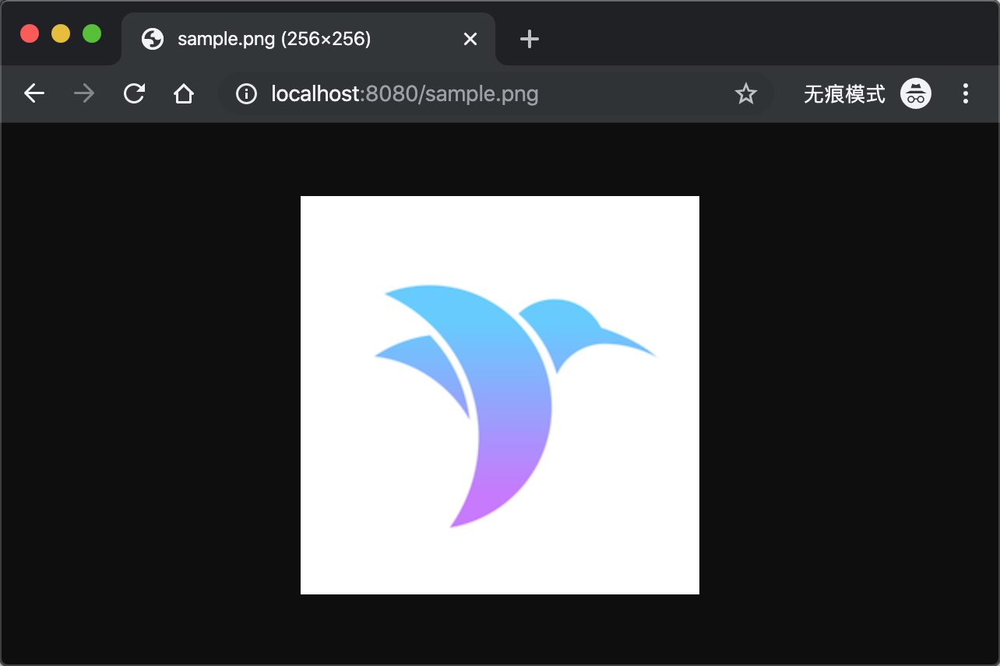

# Middleware

`Middleware` 是一个中间件组件，它可以在 `请求前` 和 `请求后` 做一些额外的处理。

## 如何使用

以系统中间件 `FileMiddleware` 为例。`FileMiddleware` 的作用是在接收到 `请求` 后，先在 `Public/` 目录下查找是否有匹配的资源文件，如果存在的话就直接返回该资源文件。

只需要在 `configure.swift` 中配置下即可。

```swift
// Register middleware
app.register(extension: MiddlewareConfiguration.self) { middlewares, app in
    // Serves files from `Public/` directory
    middlewares.use(app.make(FileMiddleware.self))
}
```

比如，我们将一张测试图片（比如：`sample.png`）存放到 `Public` 目录中，在本地服务已启动的情况下（假设所占端口为 `8080`），访问 `http://localhost:8080/sample.png` 地址可直接显示 `Public/` 目录下的 `sample.png` 图片。

效果如下



## Middleware 源码

`Middleware` 其实是一个 `protocol` ，内部定义了 `respond` 方法，源码如下：

```swift
public protocol Middleware {
    /// Called with each `Request` that passes through this middleware.
    /// - parameters:
    ///     - request: The incoming `Request`.
    ///     - next: Next `Responder` in the chain, potentially another middleware or the main router.
    /// - returns: An asynchronous `Response`.
    func respond(to request: Request, chainingTo next: Responder) -> EventLoopFuture<Response>
}
```

可以在 `respond` 方法中做一些额外的处理。

## FileMiddleware 源码分析

`FileMiddleware` 源码如下：

```swift
public final class FileMiddleware: Middleware {
    /// The public directory.
    /// - note: Must end with a slash.
    private let publicDirectory: String

    /// Creates a new `FileMiddleware`.
    public init(publicDirectory: String) {
        self.publicDirectory = publicDirectory.hasSuffix("/") ? publicDirectory : publicDirectory + "/"
    }

    /// See `Middleware`.
    public func respond(to request: Request, chainingTo next: Responder) -> EventLoopFuture<Response> {
        // make a copy of the path
        var path = request.url.path

        // path must be relative.
        while path.hasPrefix("/") {
            path = String(path.dropFirst())
        }

        // protect against relative paths
        guard !path.contains("../") else {
            return request.eventLoop.makeFailedFuture(Abort(.forbidden))
        }

        // create absolute file path
        let filePath = publicDirectory + path

        // check if file exists and is not a directory
        var isDir: ObjCBool = false
        guard FileManager.default.fileExists(atPath: filePath, isDirectory: &isDir), !isDir.boolValue else {
            return next.respond(to: request)
        }

        // stream the file
        let res = request.fileio.streamFile(at: filePath)
        return request.eventLoop.makeSucceededFuture(res)
    }
}
```

查看 `FileMiddleware` 中的 `respond` 方法得知，如果 `FileManager.default.fileExists` 方法来 判断指定资源文件是否存在，如果存在的话，就直接将该资源文件返回给客户端，否则通过 `next.respond(to: request)` 来执行进一步的操作。

## 自定义 Middleware

我们将自定义一个 `Middleware` 组件，作用是对 `Request` 请求处理完后返回的 `Response` 的 `Header` 信息中统一添加一个 Key（比如：`My-Key`）。

### 创建

创建 `MyMiddleware.swift` 文件，存放于 `App/Middleware/` 目录下。

```swift
import Vapor

public final class MyMiddleware: Middleware {
    
    public func respond(to request: Request, chainingTo next: Responder) -> EventLoopFuture<Response> {
        
        // Handle request before
        // ......
        
        // Handle request
        let resposneFuture = next.respond(to: request)
        
        // Handle request after
        return resposneFuture.flatMap { response in
            response.headers.add(name: "My-Key", value: "Test123456")
            
            return request.eventLoop.makeSucceededFuture(response)
        }
    }
}
```

调用 `next.respond(to: request)` 将会唤起路由相关的回调，并对请求进行处理。然后通过 `response.headers.add(name: "My-Key", value: "Test123456")` 来给的 `Response` 的 `Header` 信息中添加一组 `Key-Value` 数据（示例中 Key 是 `My-Key`，Value 是 `Test123456`）。

### 使用

在 `configure.swift` 文件中添加如下代码，`MyMiddleware` 中间件将立即生效：

```
app.register(MyMiddleware.self) { app in
    return MyMiddleware()
}

// Register middleware
app.register(extension: MiddlewareConfiguration.self) { middlewares, app in
    middlewares.use(app.make(MyMiddleware.self))
}
```

此时启动服务后，访问任意一个接口，返回的 `Reponse` 中的头信息中都将包含 `My-Key` 的信息。