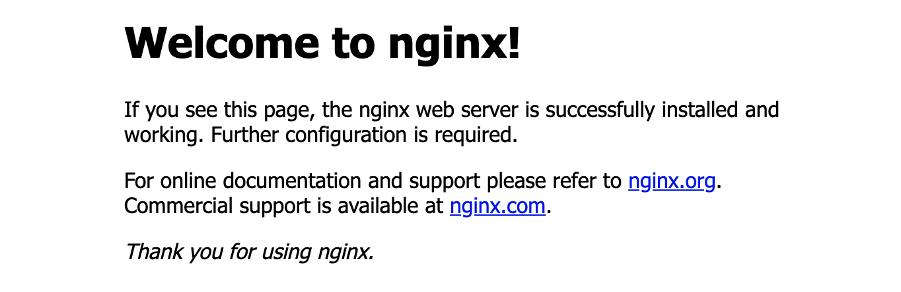

# 部署

目前 `Swift` 官方支持 `macOS` 和 `Ubuntu` 操作系统，本教程使用的是 `Ubuntu`。

## Nginx

### 安装

通过 `APT` 方式安装：

```shell
sudo apt-get update
sudo apt-get install nginx
```

如果 `Nginx` 安装成功的话，访问对应服务器 `ip` 地址，将显示如下内容：



### 配置

`/etc/nginx/sites-available/` 目录下存放了 `Nginx` 相关的配置文件，可以新建一个文件，比如命名为 `hello` 。

编辑如下：

```
server {
    server_name hello.com;
    listen 80;

    root /home/vapor/Hello/Public/;

    location @proxy {
        proxy_pass http://127.0.0.1:8080;
        proxy_pass_header Server;
        proxy_set_header Host $host;
        proxy_set_header X-Real-IP $remote_addr;
        proxy_set_header X-Forwarded-For $proxy_add_x_forwarded_for;
        proxy_pass_header Server;
        proxy_connect_timeout 3s;
        proxy_read_timeout 10s;
    }
}
```

配置成功后，执行 `nginx -s reload` 命令使得刚刚的配置生效。

## 安装 Docker

`Docker` 安装步骤可参考：[Docker官网](https://docs.docker.com/engine/install/ubuntu/)

## 运行

`Vapor` 项目初始化成功后会有个 `web.Dockerfile` 文件，内容类似如下：

```shell
# ================================
# Build image
# ================================
FROM vapor/swift:5.2 as build
WORKDIR /build

# Copy entire repo into container
COPY . .

# Install sqlite3
RUN apt-get update -y \
	&& apt-get install -y libsqlite3-dev

# Compile with optimizations
RUN swift build \
	--enable-test-discovery \
	-c release \
	-Xswiftc -g

# ================================
# Run image
# ================================
FROM vapor/ubuntu:18.04
WORKDIR /run

# Copy build artifacts
COPY --from=build /build/.build/release /run
# Copy Swift runtime libraries
COPY --from=build /usr/lib/swift/ /usr/lib/swift/

ENTRYPOINT ["./Run", "serve", "--env", "production", "--hostname", "0.0.0.0", "--port", "80"]
```

通过如下命令，根据 `dockerfile` 文件构建 `docker` 镜像。

```shell
docker build -f <dockerfile文件路径> -t vapor/hello .
```

* **-f 参数**：指定 dockerfile 文件路径。
* **-t 参数**：镜像名字。

构建成功后，执行 `docker images` 命令，将显示类似如下内容，其中 `vapor/hello` 就是我们刚刚构建好的镜像。

```shell
REPOSITORY          TAG                 IMAGE ID            CREATED             SIZE
vapor/hello         latest              e742283e65de        36 minutes ago      464MB
vapor/ubuntu        18.04               0577b24788a4        2 weeks ago         141MB
vapor/swift         5.2                 c9cfd6d5eeb2        2 weeks ago         1.68GB
```

接下来，基于 `vapor/helllo` 镜像实例化容器。

```shell
docker run -d -p 8080:80 --name vapr-hello-zzb vapor/hello
```

* **-d 参数**：表示后台运行。
* **-p 参数**：端口映射关系。
* **-name 参数**：指定容器实例名字。

实例化成功后，通过 `docker ps` 可查看当前实例运行情况。

```shell
CONTAINER ID        IMAGE               COMMAND                  CREATED             STATUS              PORTS                  NAMES
f26da06871a4        vapor/hello         "./Run serve --env p…"   14 minutes ago      Up 14 minutes       0.0.0.0:8080->80/tcp   vapr-hello-zzb
```

## 测试

此时，访问服务器 `ip` 地址，将显示如下 `It works!` 内容，表示 `Nginx` 已将 `80` 端口的请求转发到 `8080` 端口的 `docker` 实例上了，大功告成。
