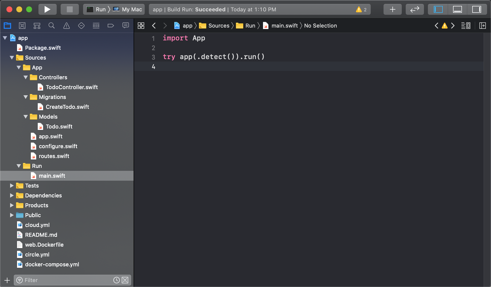

# Hello World

本章教程教将带你创建第一个 Vapor 项目。

## 创建项目

通过 vapor 命令行工具创建项目，项目名称命名为 ```Vapor4Example```。

```
vapor new Vapor4Example -branch=4
```

创建成功后，将输出如下信息。

```
Cloning Template [Done]
Updating Package Name [Done]
Initializing git repository [Done]

		                                     **
		                                   **~~**
		                                 **~~~~~~**
		                               **~~~~~~~~~~**
		                             **~~~~~~~~~~~~~~**
		                           **~~~~~~~~~~~~~~~~~~**
		                         **~~~~~~~~~~~~~~~~~~~~~~**
		                        **~~~~~~~~~~~~~~~~~~~~~~~~**
		                       **~~~~~~~~~~~~~~~~~~~~~~~~~~**
		                      **~~~~~~~~~~~~~~~~~~~~~~~~~~~~**
		                      **~~~~~~~~~~~~~~~~~~~~~~~~~~~~**
		                      **~~~~~~~~~~~~~~~~~~~~~++++~~~**
		                       **~~~~~~~~~~~~~~~~~~~++++~~~**
		                        ***~~~~~~~~~~~~~~~++++~~~***
		                          ****~~~~~~~~~~++++~~****
		                             *****~~~~~~~~~*****
		                                *************
		                       
		                       _       __    ___   ___   ___
		                      \ \  /  / /\  | |_) / / \ | |_)
		                       \_\/  /_/--\ |_|   \_\_/ |_| \
		                         a web framework for Swift

		                  Project "Vapor4Example" has been created.
		           Type `cd Vapor4Example` to enter the project directory.
		           Use `vapor cloud deploy` to host your project for free!
		                                   Enjoy!
```

## 运行项目

此时，我们先不分析代码，先将该 vapor 项目 run 起来，看看最终效果。

步骤如下：

* 执行 ```cd Vapor4Example``` 进入到刚创建好的项目目录中。

* 通过如下命令 build 项目代码。

```
vapor build
```

build 成功后将输出如下信息。

```
Building Project [Done]
```

* 通过如下命令 run 项目。

```
vapor run
```

这时候将输出如下信息。

```
Running app ...
[ NOTICE ] Server starting on http://127.0.0.1:8080
```

然后访问 ```http://127.0.0.1:8080``` 地址，如果返回 ```It works!```，则意味着你的第一个 vapor 项目已经 run 成功了。

## 生成 Xcode 项目

执行 ```vapor xcode``` 命令，将会自动生成一个完整的 Xcode 项目。

```
$ vapor xcode
Generating Xcode Project [Done]
Select the `Run` scheme to run.
Open Xcode project?
y/n> y
Opening Xcode project...
```

可以选择 Xcode 中的 ```Run``` scheme 进行编译运行。

如图所示



## 目录结构

接下来将具体分析下项目目录结构，如下所示。


```
.
├── Public
├── Sources
│   ├── App
│   │   ├── Controllers
│   │   ├── Migrations
│   │   ├── Models
│   │   ├── app.swift
│   │   ├── configure.swift
│   │   └── routes.swift
│   └── Run
│       └── main.swift
├── Tests
│   └── AppTests
└── Package.swift
```

### Public

该目录主要存放一些可公开访问的资源文件，比如图片文件、CSS 文件以及 JavaScript 文件等。

首先，需修改 ```configure.swift``` 文件来开启使用 ```FileMiddleware``` 中间件。

```
// Called before your application initializes.
func configure(_ app: Application) throws {
    ......

    // Register middleware
    app.register(extension: MiddlewareConfiguration.self) { middlewares, app in
        // Serves files from `Public/` directory
        middlewares.use(app.make(FileMiddleware.self))
    }
    
    ......
}
```

然后，所有 ```Public/``` 目录下的资源文件均可直接被访问了。比如 ```Public/``` 目录下有一张图片（命名为 ```sample.png```），在本地服务已启动的情况下（假设所占端口为 ```8080```），访问 ```http://localhost:8080/sample.png``` 地址可直接显示 ```Public/``` 目录下的 ```sample.png``` 图片。

效果如下


### Sources

该目录用于存放源代码。

#### App

主要是用来存放业务相关的代码。

* Controllers：用于存放具体业务逻辑的实现代码。
* Migrations：用于存放数据库迁移相关的代码。
* Models：用于存放数据模型相关的代码。
* app.swift：用于服务初始化相关的代码文件。
* configure.swift：用于服务器配置相关的代码文件。
* routes.swift：用于 API 请求的路由控制。

#### Run

该目录下有一个 ```main.swift``` 文件，是整个程序的执行入口。

#### Tests

该目录主要是用于存放测试相关的代码。

### Package.swift

Vapor 项目所依赖的库是通过 [SPM（Swift Package Manager）](https://github.com/apple/swift-package-manager) 来进行管理的。

示例如下

```
// swift-tools-version:5.1
import PackageDescription

let package = Package(
    name: "app",
    platforms: [
       .macOS(.v10_15)
    ],
    products: [
        .executable(name: "Run", targets: ["Run"]),
        .library(name: "App", targets: ["App"]),
    ],
    dependencies: [
        // 💧 A server-side Swift web framework.
        .package(url: "https://github.com/vapor/vapor.git", from: "4.0.0-beta"),
        .package(url: "https://github.com/vapor/fluent.git", from: "4.0.0-beta"),
        .package(url: "https://github.com/vapor/fluent-sqlite-driver.git", from: "4.0.0-beta"),
    ],
    targets: [
        .target(name: "App", dependencies: ["Fluent", "FluentSQLiteDriver", "Vapor"]),
        .target(name: "Run", dependencies: ["App"]),
        .testTarget(name: "AppTests", dependencies: ["App"])
    ]
)
```