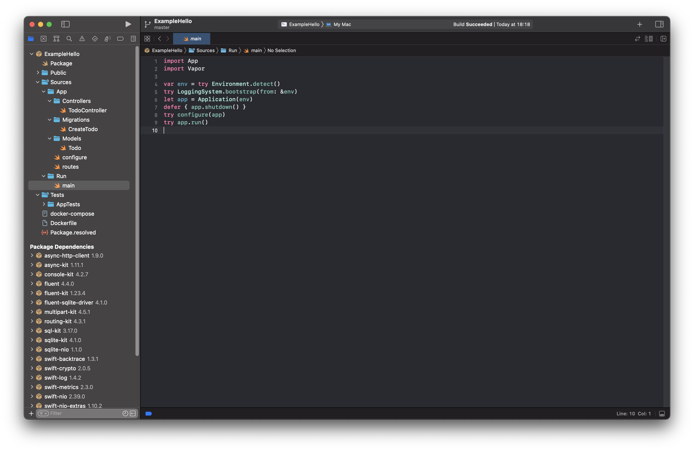
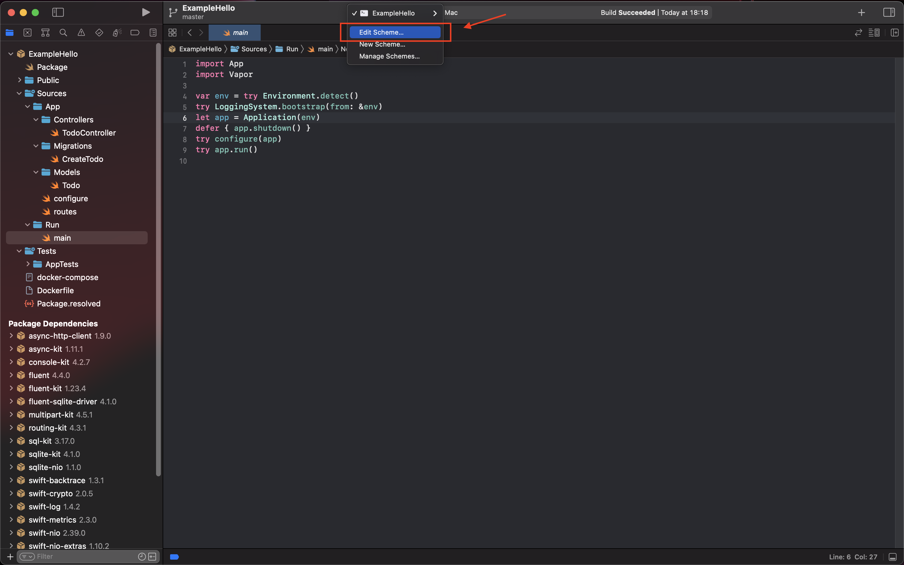
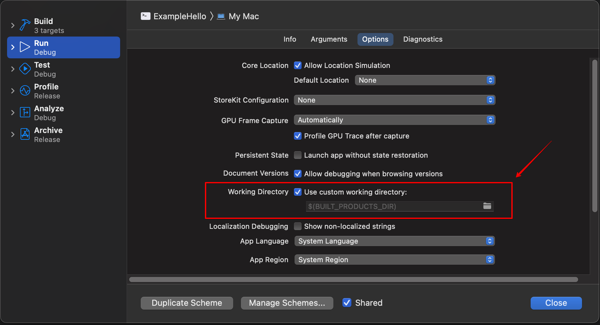

# Hello World

本章教程教将带你创建第一个 `Vapor` 项目。

## 创建项目

通过 `vapor` 命令行工具创建项目，项目名称命名为 `ExampleHello`。

```shell
vapor new ExampleHello
```

创建成功后，将输出如下信息。

```shell
Cloning template...
name: ExampleHello
Would you like to use Fluent? (--fluent/--no-fluent)
y/n> y
fluent: Yes
db: SQLite
Would you like to use Leaf? (--leaf/--no-leaf)
y/n> n
leaf: No
Generating project files
+ Package.swift
+ main.swift
+ configure.swift
+ routes.swift
+ Todo.swift
+ CreateTodo.swift
+ .gitkeep
+ TodoController.swift
+ AppTests.swift
+ .gitkeep
+ Dockerfile
+ docker-compose.yml
+ .gitignore
+ .dockerignore
Creating git repository
Adding first commit
                                                                                                  
                                     **               
                                   **~~**             
                                 **~~~~~~**           
                               **~~~~~~~~~~**         
                             **~~~~~~~~~~~~~~**       
                           **~~~~~~~~~~~~~~~~~~**     
                         **~~~~~~~~~~~~~~~~~~~~~~**   
                        **~~~~~~~~~~~~~~~~~~~~~~~~**  
                       **~~~~~~~~~~~~~~~~~~~~~~~~~~** 
                      **~~~~~~~~~~~~~~~~~~~~~~~~~~~~**
                      **~~~~~~~~~~~~~~~~~~~~~~~~~~~~**
                      **~~~~~~~~~~~~~~~~~~~~~++++~~~**
                       **~~~~~~~~~~~~~~~~~~~++++~~~** 
                        ***~~~~~~~~~~~~~~~++++~~~***  
                          ****~~~~~~~~~~++++~~****    
                             *****~~~~~~~~~*****      
                                *************         
                                                      
                       _       __    ___   ___   ___  
                      \ \  /  / /\  | |_) / / \ | |_) 
                       \_\/  /_/--\ |_|   \_\_/ |_| \ 
                         a web framework for Swift    
                                                      
                   Project ExampleHello has been created!
                                      
            Use cd 'ExampleHello' to enter the project directory
          Then use open Package.swift to open the project in Xcode
```

!!! note
	
	命令行中选择了 `fluent` 以及 `SQLite` 来做示例。当然，也可以在初始化项目后再另行添加。

## 运行项目

此时，我们先不分析代码，先将该 `vapor` 项目 `run` 起来，看看最终效果。

步骤如下：

* 执行 `cd ExampleHello` 进入到刚创建好的项目目录中。

* 通过如下命令 build 项目代码。

```shell
vapor build
```

`build` 成功后将输出如下信息。

```shell
...
Build complete!
Project built.
```

* 通过如下命令 `run` 项目。

```shell
vapor run
```

这时候将输出如下信息。

```shell
[ NOTICE ] Server starting on http://127.0.0.1:8080
```

然后访问 `http://127.0.0.1:8080` 地址，如果返回 `It works!`，则意味着你的第一个 `Vapor` 项目已经 `run` 成功了。

## 生成 Xcode 项目

执行 `vapor xcode` 命令，将会自动生成一个完整的 Xcode 项目。

```shell
$ vapor xcode
Opening project in Xcode.
```

可以选择 `Xcode` 中的 `Run` scheme 进行编译运行。

如图所示



## 目录结构

接下来将分析下项目的目录结构，如下所示。


```shell
.
├── Public
├── Sources
│   ├── App
│   │   ├── Controllers
│   │   ├── Migrations
│   │   ├── Models
│   │   ├── configure.swift
│   │   └── routes.swift
│   └── Run
│       └── main.swift
├── Tests
│   └── AppTests
└── Package.swift
```

### Public

该目录主要存放一些可公开访问的资源文件，比如图片文件、`CSS` 文件以及 `JavaScript` 文件等。

首先，需修改 `configure.swift` 文件来开启使用 `FileMiddleware` 中间件。

``` swift
// configures your application
public func configure(_ app: Application) throws {
    ......

    // Serve files from /Public folder
    app.middleware.use(FileMiddleware(publicDirectory: app.directory.publicDirectory))
    
    ......
}
```

然后，所有 `Public/` 目录下的资源文件均可直接被访问了。比如 `Public/` 目录下有一张图片（命名为 `sample.png`），在本地服务已启动的情况下（假设所占端口为 `8080`），访问 `http://127.0.0.1:8080/sample.png` 地址可直接显示 `Public/` 目录下的 `sample.png` 图片。

效果如下


注意，如果你不是通过命令行，而是通过 `Xcode` 打开并运行该 `Vapor` 项目的话，此时你会发现报如下错误：

```	
{"error":true,"reason":"Not Found"}
```

这是因为 `Xcode` 默认的 `Working Directory` 是 `DerivedData` 目录，而非当前项目所在目录。此时，可通过编辑 `Xcode` 中的 `Scheme` 来进行设置。



找到 `Run` -> `Options` -> `Working Directory`，勾选 `Use custom working directory` 选项并将当前项目的根目录设置为 `Working Directory` 即可。



### Sources

该目录用于存放源代码。

#### App

主要是用来存放业务相关的代码。

* Controllers：用于存放具体业务逻辑的实现代码。
* Migrations：用于存放数据库迁移相关的代码。
* Models：用于存放数据模型相关的代码。
* configure.swift：用于服务配置相关的代码文件。
* routes.swift：用于 API 请求的路由控制。

#### Run

该目录下有一个 `main.swift` 文件，是整个程序的执行入口。

#### Tests

该目录主要是用于存放测试相关的代码。

### Package.swift

`Vapor` 项目所依赖的库是通过 [SPM（Swift Package Manager）](https://github.com/apple/swift-package-manager) 来进行管理的。

示例如下

``` swift
// swift-tools-version:5.6
import PackageDescription

let package = Package(
    name: "ExampleHello",
    platforms: [
       .macOS(.v12)
    ],
    dependencies: [
        // 💧 A server-side Swift web framework.
        .package(url: "https://github.com/vapor/vapor.git", from: "4.0.0"),
        .package(url: "https://github.com/vapor/fluent.git", from: "4.0.0"),
        .package(url: "https://github.com/vapor/fluent-sqlite-driver.git", from: "4.0.0"),
    ],
    targets: [
        .target(
            name: "App",
            dependencies: [
                .product(name: "Fluent", package: "fluent"),
                .product(name: "FluentSQLiteDriver", package: "fluent-sqlite-driver"),
                .product(name: "Vapor", package: "vapor")
            ],
            swiftSettings: [
                // Enable better optimizations when building in Release configuration. Despite the use of
                // the `.unsafeFlags` construct required by SwiftPM, this flag is recommended for Release
                // builds. See <https://github.com/swift-server/guides/blob/main/docs/building.md#building-for-production> for details.
                .unsafeFlags(["-cross-module-optimization"], .when(configuration: .release))
            ]
        ),
        .executableTarget(name: "Run", dependencies: [.target(name: "App")]),
        .testTarget(name: "AppTests", dependencies: [
            .target(name: "App"),
            .product(name: "XCTVapor", package: "vapor"),
        ])
    ]
)
```

## 简析 Vapor 启动过程

接下来我们简单分析下 Vapor 示例项目启动的过程。

首先来看下 `main.swift` 文件，这个是整个程序执行的入口。

``` swift
import App
import Vapor

var env = try Environment.detect()
try LoggingSystem.bootstrap(from: &env)
let app = Application(env)
defer { app.shutdown() }
try configure(app)
try app.run()

```

`import App` 和 `import Vapor` 是用来导入 `App` 和 `Vapor` module 的，通过执行 `try app.run()` 运行服务。

其中，`Environment.detect()` 方法是用来检测当前运行环境，源码如下

``` swift
public static func detect(arguments: [String] = CommandLine.arguments) throws -> Environment {
    var commandInput = CommandInput(arguments: arguments)
    return try Environment.detect(from: &commandInput)
}
```

从代码中可以看出，根据 `env` 参数，先初始化了日志系统 `LoggingSystem`，然后创建了 `Application` 实例对象，最后再调用 `configure()` 方法来初始化配置。

`configure()` 方法定义在 `configure.swift` 中，源码如下

``` swift
// Configures your application
public func configure(_ app: Application) throws {
    // Serve files from /Public folder
    app.middleware.use(FileMiddleware(publicDirectory: app.directory.publicDirectory))

    // Configure SQLite database
    app.databases.use(.sqlite(.file("db.sqlite")), as: .sqlite)

    // Configure migrations
    app.migrations.add(CreateTodo())

    // Register routes
    try routes(app)
}
```

从源码中可见，`configure()` 方法内部注册了 `middleware`（比如：`FileMiddleware`）、数据库相关的配置，以及 API 路由的配置。

!!! note
	
	这里就不展开讨论这些 Vapor 组件了，比如 `Middleware` 等，后续章节将进行详细介绍。
	

接下来，我们看下 `routes()` 方法的实现，它是定义在 `routes.swift` 文件中，源码如下

``` swift
func routes(_ app: Application) throws {
    app.get { req in
        return "It works!"
    }

    app.get("hello") { req -> String in
        return "Hello, world!"
    }

    try app.register(collection: TodoController())
}
```

之前，访问 `http://127.0.0.1:8080` 地址，返回了 `It works!` 文本，其实对应的就是这部分代码。

``` swift
app.get { req in
    return "It works!"
}
```

这是在根路径下，监听了 `GET` 行为，当通过 `GET` 方式请求根路径（比如：`http://127.0.0.1:8080`）时，将返回一串文本 `It works!` 。

同理，第二段代码

``` swift
app.get("hello") { req -> String in
    return "Hello, world!"
}
```

监听了路径为 `hello` 的 `GET` 请求，当通过 `GET` 方式请求对应路径（比如：`http://127.0.0.1:8080/hello`）时，将返回一串文本 `Hello, world!` 。

再看下第三段代码（位于 `TodoController.swift` 文件）

``` swift
func boot(routes: RoutesBuilder) throws {
    let todos = routes.grouped("todos")
    
    // 请求路径：todos，请求方法: GET，响应方法：index。
    todos.get(use: index)
    
    // 请求路径：todos，请求方法: POST，响应方法：create。
    todos.post(use: create)
    
    // 请求路径：todos，请求方法: DELETE，响应方法：delete。
    todos.group(":todoID") { todo in
        todo.delete(use: delete)
    }
}
```

路径为 `todos` 的请求（`GET`、`POST`、`DELETE`）都将被映射到 `TodoController` 中，在该 `Controller` 中可以处理相关的业务逻辑。

``` swift
struct TodoController {

	func index(req: Request) async throws -> [Todo] {
        ......
    }

    func create(req: Request) async throws -> Todo {
        ......
    }

    func delete(req: Request) async throws -> HTTPStatus {
        ......
    }
}
```

!!! note

	如果想调试上述 `API`，请先执行 `vapor run migrate` 创建对应的数据库以及表。

回到 `main.swift` 文件，当 `app` 实例初始化后，最后将执行 `run()` 方法来启动服务。

``` swift
try app.run()
```

`run()` 源码如下

``` swift
public func run() throws {
    do {
        try self.start()
        try self.running?.onStop.wait()
    } catch {
        self.logger.report(error: error)
        throw error
    }
}
```

至此，我们对 `Vapor` 项目启动的执行过程有了大致的了解，后面将具体介绍 `Vapor` 的各个模块。

## 示例代码

可参考：[ExampleHello](https://github.com/CaryZheng/Vapor4-Tutorial/tree/master/code/ExampleHello)